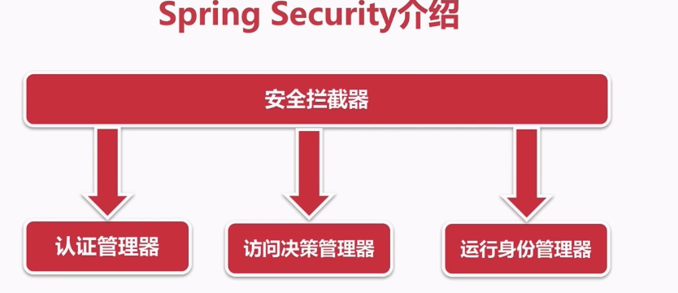
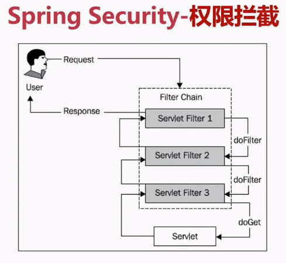
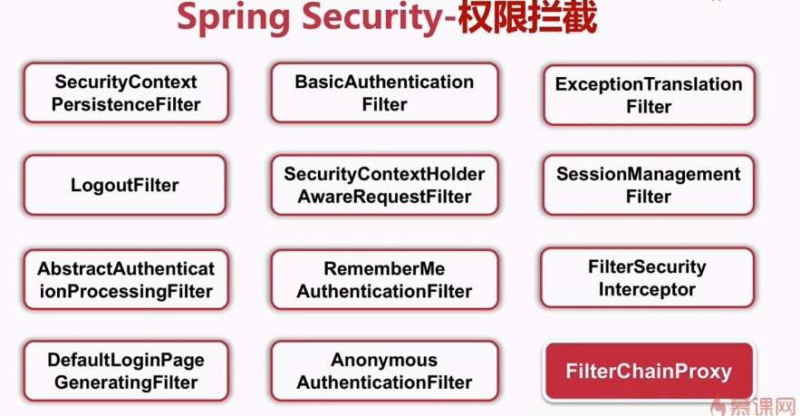
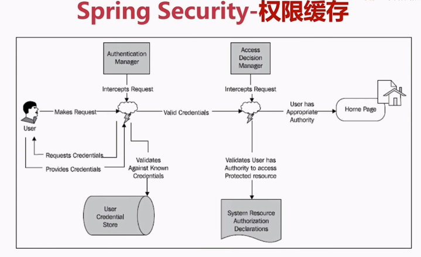

# Spring Security

1. 框架结构

   

   - 身份认证方式
      - Basic
      - Digest
      - X.509 证书认证
      - LDAP
      - FORM

1. 权限拦截

    

    1. SecurityContextPersistenceFilter
        1. ThreadLocal源码分析
            - 线程安全
            - 线程结束时清除当前线程信息
    1. LogoutFilter
    1. AbstractAuthenticationProcessingFilter
    1. DefaultLoginPageGeneratingFilter
    1   - 默认登陆页面
    1. BasicAuthenticationFilter
    1. SecurityContextHolderAwareRequestFilter
    1. RememberMeAuthenticationFilter
    1. AnonymousAuthenticationFilter
    1. ExceptionTranslationFilter
    1. SessionManagementFilter
    1. FilterSecurityInterceptor
    
    
    
     
1. 数据库管理
   - 用户表
   - 权限表
   - 角色表
1. 权限缓存 
1. 自定义决策
    - 投票器    
1. 优缺点        
    